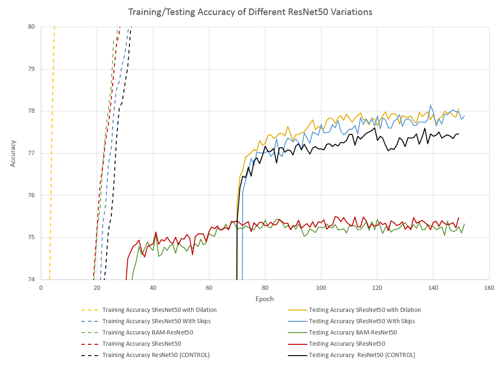

# Experimental Neural Networks
Experimental Neural Networks that I have built to test different ideas to try and improve the accuracy and/or efficiency of neural network training.

## How to use
To train a neural network, run cifar.py from a command-line interface with proper arguments.
Commandline Arguments

--lr=0.1            Starting learning rate for training process

--resume=False      Resume training using a pretrained model. Will check for a file with the name of the network
                    in /checkpoint directory
                    
--netName           This must be a network name from the installed networks in /models.
                    To install a network, see the section below.
                    
--bs=512            Batch size to be used in training

--es=150            Number of epochs to train ('Epoch Size')

--cifar=100         Version of CIFAR to use. Must be 10 or 100.

--fix_seed=123      Seed for the random number generator used by the Stochastic Gradient Descent

--pre_process=False Indicates whether the pre-processing alpha channel should be added before feeding it into the network.
                    NOTE: since the images will now have 4 color channels, this breaks many neural networks.

e.g.
    python3 cifar.py --netName=PreActResNet18 --cifar=10 --bs=512

HOW TO USE THIS SCRIPT WITH A CUSTOM NEURAL NETWORK
1. Create a python file in /models with a function that returns an instance of your network.
2. Override the \_\_all__ variable to be a list that includes a string containing the name of the above function.
e.g. \_\_all__ = \['SResNet50', 'SResNet50WithSkips', 'SResNet18WithSkips', 'SResNet50WithDilation']
3. Make sure that /models/\_\_init__.py includes the line:
    from .FileNameHere import *
4. Run this script from a command line interface with the proper aruments.

## ResNet50 with Different Attention Modules
Many researchers are currently attempting to design a better Attention Module for deep networks. Here, we tested some examples:
1. A regular ResNet50
2. A ResNet50 with [Bottleneck Attention Module](https://arxiv.org/abs/1807.06514)
3. An SResNet50, designed by [Xu Ma](https://github.com/13952522076)
4. A modified SResNet50 with skip connections inside its Attention Block, designed by Andrew Sansom
5. A modified SResNet50 whose attention blocks' convolutional layers use dilation

We include one, focused graph, showing the test accuracy of these different networks. For a more complete discussion, see the [Attention Results directory](./AttentionResults)

Clearly, the use of skip connections or dilation in the SResNet50 attention module improve accuracy dramatically over a standard ResNet50 or even a BAM-ResNet50.

## Ablated SE-ResNet Tests
We trained several different modified versions of an SE-ResNet18 to see which SE blocks affected the results most. 
We conducted ten experiments, an SE-ResNet18 without any removed SE Blocks, one with all its SE blocks removed,
four separate trials with one individual block removed, and four trials with only a single SE block enabled in the network.

Conclusions

-All experiments suggest that SE blocks on the first layer of a ResNet will decrease its classification accuracy.

-All experiments suggest that SE blocks in the second layer of a ResNet increase accuracy the most.

-All experiments suggest SE blocks in the third layer of a ResNet have little effect on the accuracy or loss.

-The removal of SE blocks in layer 4 decreased the loss with only a small increase in test accuracy, suggesting that SE blocks in layer 4 mostly help prevent over-fitting, while contributing only a little to the classification.

For a more complete discussion of these results, see [the Ablation Results directory](./AblationResults).

To run these experiments yourself, use the [Missing Blocks Script](./cifarWithMissingBlocks.py) from a command-line interface, and adjust its arguments as necessary.

## Peer Tutor Networks

## Image Pre-processing Using Edge Detection and Fill Techniques